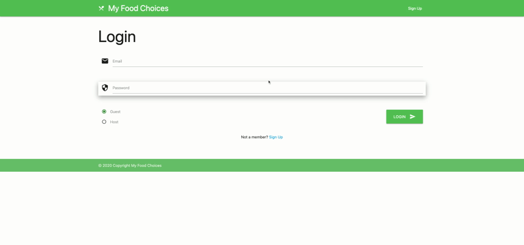
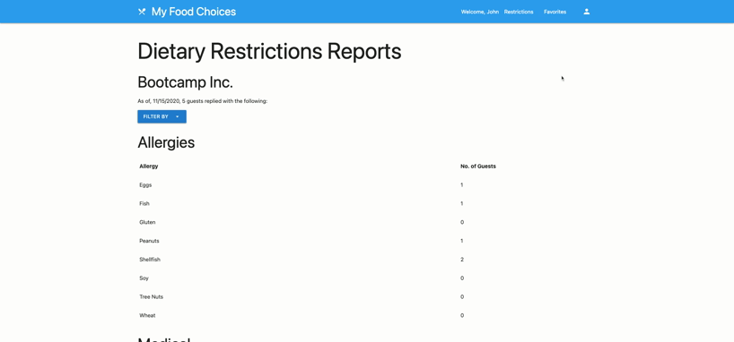
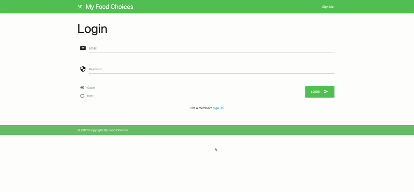
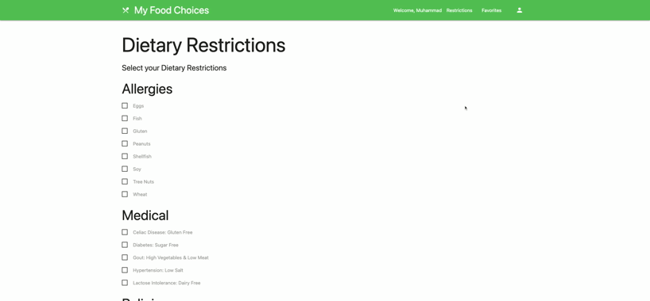

# My Food Choices

## Description

Have you ever been to an event where food was served, and you, or someone you know, had a hard time finding food that they like or that fits their dietary needs?

Well, the solution is **My Food Choices!**

**My Food Choices** is a simple tool for Guests to store their dietary restrictions and food favorites to share with event organizers for any event where food is served!

It has an interface for Guests to enter their dietary choices, and another for event organizers/food servers to view the needs of the entire list of guests.

## Table of Contents

- [Deployment URL](#Deployment-URL)
- [GitHub Repo URL](#GitHub-Repo-URL)
- [Demo](#Demo)
- [Features](#Features)
- [Usage](#Usage)
- [Future Upgrades](#Future-Upgrades)
- [Contributors](#Contributors)
- [Technologies Used](#Technologies-Used)
- [License](#License)
- [Patent and Commercial Rights](#Patent-and-Commercial-Rights)

## Deployment URL

https://myfoodchoices.herokuapp.com/

## GitHub Repo URL

https://github.com/ahmadelgamal/ucb-my-food-choices

## Demo

### Host (Admin) Sign Up

### Host (Admin) Reports

### Guest (User) Login

### Guest (User) Profile Update

## Features

This first version is setup so that a company with an office kitchen can query its employees for their dietary needs and restrictions, as well as food favorites, in order to prepare food that fits their needs.

1. Employees will receive an email from the company admin (Host) with a link (url) to the app homepage.
1. Once they visit the homepage, they can:
   1. Sign up.
   1. Login.
   1. Check boxes that correspond to their dietary restrictions.
   1. Select their food favorites.
   1. Save their profile.
   1. Update their profile.
   1. Change their password.
   1. Delete their account.
1. Organizer will get a report with:
   1. The number of employees that signed up.
   1. The total number of employees in each dietary restriction category.
   1. This will help the organizer plan the food that better fits the employees' needs.
   1. Change their password.
   1. Delete their account.

## Usage

1. Restaurants
1. Travel: airlines, cruise ships, hotels, etc.
1. Education: universities, colleges, schools, daycares, and nurseries.
1. Office Kitchens
1. Personal: gatherings of family and friends, whether they are large gatherings, like weddings, or smaller ones, like Thanksgiving.

Simply put, whether it is business or personal, this app will help you find the food of your choice!

### Example 1

You work in Human Resources for a mid-size firm and you are organizing an event to honor the best employees of the year in the firm. You are inviting 200 employees to a hall in a hotel and you want to tell the kitchen what to cook. However, amongst the employees are:

1. Cohen: He wants kosher food with low salt for his hypertension.
1. Aaditi: She wants no beef because she's hindhu, but she also does not eat fish.
1. Muhammad: He wants halal food, but he's also diabetic and doesn't like broccoli.
1. Amy: She's vegetarian.

_Future options:_

1. 150 guests prefer mashed potatoes over french fries

1. 120 guests prefer pasta over rice.
1. 50 guests are following a keto diet.
1. Only 10 guests like canned juice.

_Well, you get the idea!_

Imagine if all of this info was stored in a database and all you had to do was click a button to send it to the hotel kitchen! The solution: **My Food Choices!** Sweet! Right?

### Example 2

You are a wedding planner and there are 150 guests invited to the wedding. You want to impress the bride and groom, so you want to offer them a tailored menu for the guests. The solution: **My Food Choices!**

You simply send a link with the wedding invitation to each guest. Guests can opt to fill out their dietary needs and preferences for the wedding event only, or they can create an account and save their choices to share for any future event with the click of a button.

Are the bride and groom impressed? You betcha!

## Future Upgrades

The list of upgrades can be endless, but the following are the top 10 future upgrades for Host and Guests to make this a world-class app.

### For Host (admin)
Give Host the option to:
1. Receive email confirmation upon sign up, change of username and change of password.
1. Recover the password.
1. Change their email (username).
1. View "detailed report", which lists all guests and their profiles.
1. Group Guests.
1. Add company logo and/or event pictures.
1. Create events.
1. Invite Guests to events.
1. Uninvite Guests to events.
1. Combine host and guest into one account so that all users can be host or guest depending on the event.

### For Guests (users)
Give Guests the option to:
1. Receive email confirmation upon sign up, change of username and change of password.
1. Recover the password.
1. Change their email (username).
1. Load profile checkmarks from database.
1. Select food preferences, such as:
   1. pasta vs. rice
   1. french fries vs. mashed potatoes
   1. shakes vs. ice cream
1. Select food dislikes
1. Add custom foods
1. Have multiple profiles, such as one for lunch, and one for dinner (this will work well with food preferences)
1. Share their profiles with hosts
1. Add their profile picture

## Contributors

This app is group 1's project 2 at the University of California, Berkeley (UCB), extension's coding bootcamp (online-blended). The group members are:

| Name             | Role                 | Technical Responsibilities                | GitHub Account                  |
| ---------------- | -------------------- | --------------------------------- | ------------------------------- |
| Aaditi Pai       | Full-Stack Developer | Host/Guest Login/Sign Up, Account Services & Food Favorites | https://github.com/aadi1988     |
| Ahmad El Gamal   | Project Manager      | Front-end, EJS & Heroku           | https://github.com/ahmadelgamal |
| Ann-Marie Orozco | Database Manager     | Database, Server & Authentication | https://github.com/ann760       |
| Brian Lopez      | Back-end Developer   | APIs, Routes & EJS                | https://github.com/brianslopez  |

## Technologies Used

- HTML5
- CSS3
- JavaScript
- Node.js
- Express.js
- EJS
- MySQL
- Sequelize
- Heroku
- Materialize CSS Framework
- Authentication (Cookies, Express session & MySQL)

## License

This project is licensed under the terms of the [MIT license](LICENSE).

## Patent and Commercial Rights

This project is not protected by any patents. The contributors do not claim any commercial rights from the reproduction of the code, nor do they claim any rights for the use of the idea or method of the app.
